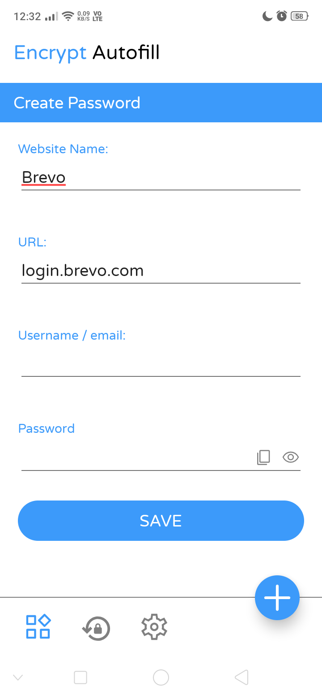

# Password Manager

A **Password Manager** Android app that securely stores and autofills passwords using accessibility services. Built using **Java** and **XML** in the AIDE app, it ensures that user data remains safe within their device.

## Features

- Save email and password combinations for any website.
- Autofill passwords directly on websites using the notification panel tile.
- Generate strong, random passwords for enhanced security.
- Import/export passwords with encryption for portability.
- Passwords are securely hashed and stored locally on the user's device.

## How It Works

1. **Storage**: All passwords are securely stored on the user's phone. They never leave the device.
2. **Autofill**: With accessibility services, the app autofills saved credentials on the respective websites.
3. **Security**: Uses industry-standard hashing algorithms to protect stored passwords.
4. **Export/Import**: Easily export your passwords and emails, which are encrypted and can be imported back when needed.

## Technologies Used

- **Java**
- **XML**
- [AIDE Android IDE](https://aide.en.uptodown.com/android) (instead of Android Studio)
- **Accessibility Services** for autofill functionality

## How to Use

1. **Save your passwords**: Store your email-password pairs for different accounts.
2. **Autofill passwords**: Use the notification tile to autofill your password on the respective website.
3. **Generate passwords**: Use the built-in password generator to create strong passwords.
4. **Export/Import**: Backup your passwords and import them on other devices.

## Installation

1. Clone the repository:
   ```bash
   git clone https://github.com/TechnicalVishalJi/Password-Manager.git
   ```
2. Open the project in AIDE or Android Studio.


3. Compile and run it on your device.

## Screenshots





## License
This project is licensed under the MIT License - see the LICENSE file for details.


---

Made with ❤️ by Vishal Singh
